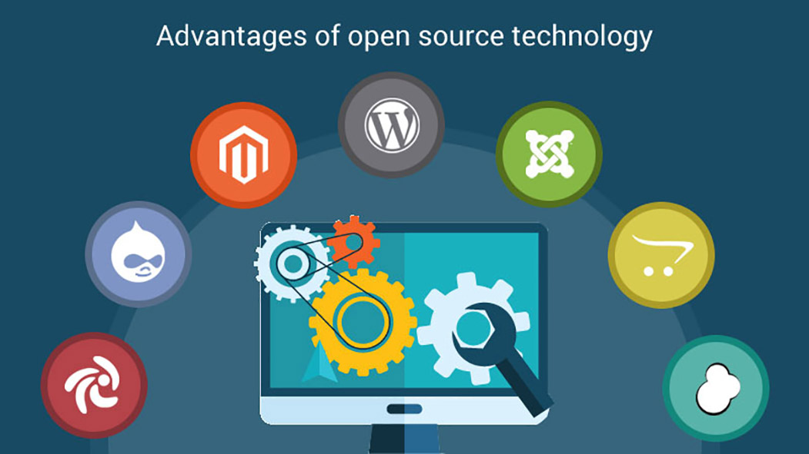

## What I Knew Before ICS 314 (Software Engineering I)

 

Before learning about software engineering and taking the course "ICS 314" at University of Hawai'i at Mānoa, I pretty much had little to no clue on what a Software Engineer does or what skills or tasks it requires. My prior experiences were about theory, algorithms, some coding, and I only knew a select few of coding languages. I had never worked with a team, let alone GitHub. Everything I had done up to that point was solo. I had imagined a software engineer to be someone who codes all day long. I figured they just create new applications and features or they maintained them. Personally, I thought it was all based on either web development or game development too. I also had an idea they worked as a team, but I did not know as to the extent of teamwork it involved. 

## Open Source Software Development

 

In this course, ICS 314, as our final project, we were to create a web application with a given topic and suggested functionality. Once the teams were formed and created, we went to work! Previously, none of us had ever worked on a web application before, let alone in a team. It was a learning experience for all of us. We were first introduced to the concept of "Open Source Software Development". This means that our code was publicly accesible, viewable, and editable by anyone. For reference, we were using Github to collaborate together. At first, we were all hesitant and thought it was odd and it would be unsafe to leave everything public, but it actually made things a lot better. Think about it; what if someone malicious were to hop on our code and delete or ruin everything? What if someone decided to steal our code? We quickly learned it was okay and that it would be okay, thankfully, because of the functionality of GitHub. On Github, you are able to undo commits, see who has edited exactly what code in which files, and most of all, you can see the user who committed it. There was surprisingly a lot of security on Github!

Once we were finished with milestones, it was also espcially helpful that our code and project was completely public. This was essential so that our Professor and peers could look over our work without any hassle. There was no need to sign-in or have exclusive access to every single team's projects. It was very easy and convenient. Otherwise, if everything was private, or even if just the tasks and issues were private, there was no way of knowing what they were and the status of them. Everyone quickly learned that making your project private turned to be much more of a hassle and risk in the end, because that would mean you would not be able to recieve any adequate feedback. 

## User Interface Frameworks

 

Another concept the entire class was introduced to was using and applying User Interface Frameworks. UI Frameworks sounds exactly like what it means. It is a set of classes and interfaces that defines elements and structures for the user's view or interface. For example, we were introduced to and used Bootstrap in a lot of our codes. This meant using Boostrap's icons, NavBar components, etc. Just simple things that add and that can enhance an application. Depending on what you are trying to build, all these little things are essential for creating a basic application. It also makes the job a whole lot easier and it is way less of a headache! 

## Agile Project Management

sfsf

## My Experiences and What I Now Know

dfgd

