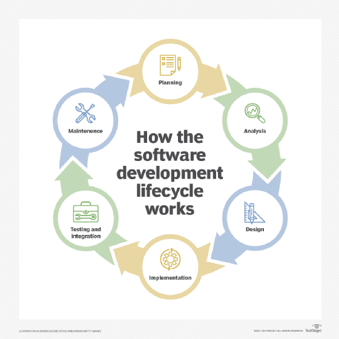

## What I Knew Before ICS 314 (Software Engineering I)

 

Before taking the course "ICS 314" at University of Hawai'i at Mānoa, I pretty much had little to no clue on what a Software Engineer does or what skills or tasks it requires. My prior experiences were about theory, algorithms, some coding, and I only knew a select few of coding languages. I had never worked with a team, let alone GitHub. Everything I had done up to that point was solo. I had imagined a software engineer to be someone who codes all day long. I figured they just create new applications and features or they maintained them. I had an idea they worked as a team, but I did not know as to the extent of teamwork it involved. 

## 

erg

## 

jg

