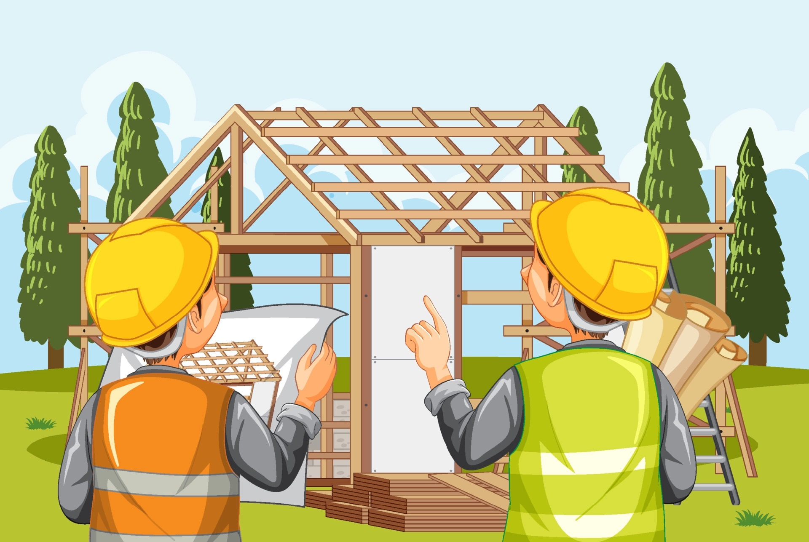

## Building a House

 

To build a house, you need to have a nice, solid foundation first. Whether you are following a template, instructions, a manual, or whatever the case may be, you need to follow it with the legal and following protocals. Next comes the frame to the house, then installing the insulation. Afterwards, the drywall and interior walls are done. Then comes the final touches of the interior, which could be a collection of things. Doors, windows, decorations, vanities, cabinets, etc. The final touches of the exterior are after, which includes the driveway, any potential balconies/patios, walkways, and yard landscaping. Once all of these are complete and you have your plumbing, electrical, and and flooring installed, you have your finished product!

## How Building a House Relates to Pattern Designs in Coding

Believe it or not, they are actually quite familiar with each other. Just like building a house, coding first takes a template and goes on from there. These templates may include implented design patterns inside of them already. Designs such as the "Prototype Pattern", the "Observer Design Pattern", "Reactive Data", "MVC Design Patterns", etc may appear anywhere from the start to the finish of someone's code. 
 
For example, the "Abstract Factory" design pattern is one of the most common design patterns there are. Just like the windows, doors, decorations, walls, etc. that you need for building a house, the Abstract Factory design pattern would be implented here for that. This design pattern creates an interface to create families of related objects. Or perhaps even if you are building a car, you need all of the car parts. The Abstract Factory will create all of these auto-parts. This pattern is even found in real life, such as the manufacturing pf Japanese automobiles; in this case, particularly the sheet metal stamping equipment. 

Another example may be the "Singleton" design pattern. This pattern provides a "global variable" in an object oriented language that does not support global variables, and/or provide complex global state. In relation to builing a house, this could be the finished product, whereas in coding, it could be your profile. These would be put in a collection and it could return a global variable, such as "FinishedHouse" or "Profile". From there, you can put as many "FinishedHouse" products and you could produce a neighborhood with it, or filter it; do whatever you want with it. 

## Has Any of This Even Helped Me?!

YES, actually! During my past and present coding experiences, I have always used design patterns. Before I even knew about design patterns, I was already using them.

One specific instance is the MVC pattern using MongoDB, where my collections where made into a model, then to view it, we used Blaze. Lastly, we used a router as a controller. Now, as you should now, MVC stands for model, view, and controller. You will almost always see the MVC pattern being used, especially for user-interface applications. It is great to use for client/server purposes. This pattern divides the related program logic into the following three interconnected elements. 

I have also used many other design patterns. A few to mention were the singleton, abstract factory, observer, and reactive data design patterns. More specifically, these were used in an application called "Bowfolios". Many of these design patterns were already implented in the template, but the others were added to it. 
